# https://github.com/1sfoerster

# Scroll down to FGPAintro and click on it:

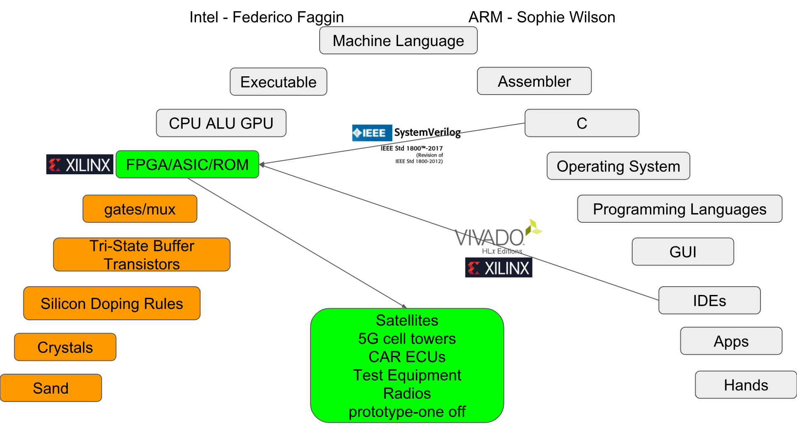

## Assumption you have some experience with Loops

If  Else  
While   
For  
Case    

## Goal

Explore circuits created using a C like programming language  called **Verilog**.   

## Requirements

Have Installed Vivado software from Xilinx  
[Downloaded and unziped these bit files](https://drive.google.com/open?id=11ywLlMnFUoLDhiu63mW3tz9Vmd1-J4VO)  
Obtained a [Nexys 4 DDR board](https://reference.digilentinc.com/reference/programmable-logic/nexys-4-ddr/reference-manual) from Digilent.   
Ability to move switches and watch LEDs.    
This is optional ... [all the Vivado Projects can be downloaded from GitHub](https://github.com/1sfoerster/FGPAintro) ... including this presentation.  

## Procedures

Take board out of the case. Foam is anti-static. Don't want to turn board on while on foam.  
Turn board off (if on), connect USB cable to computer first, then to the board second.  
Turn board on.  Should see a demo program.  
Start Vivado.    
On left click on > PROGRAM AND DEBUG  
Click on > Open Hardware Manager  
Click on Open target    

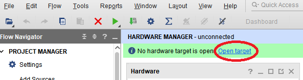

Click on Auto Connect

Wait through two splash screens until this appears and click on Program Device

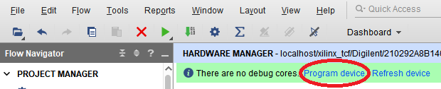

Click on the three dots

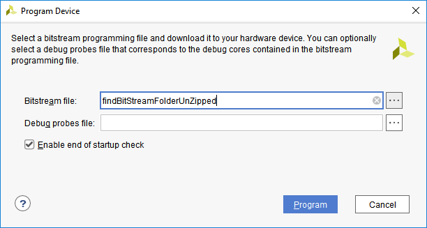

Navigate to the BitStream folder unzipped and choose the bit file 0_1_Hello World   
Then click Program above.  The next step is to play with the switches and look at LEDs.

## 0 Hello World

#### 0_1_HelloWorld

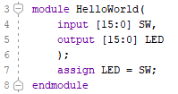

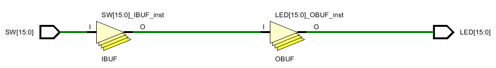

## 1 Parallel, Sequential, Non-blocking Programming

### Line order DOESN'T Matter

#### 1_1_Parallel_a

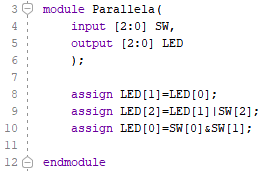

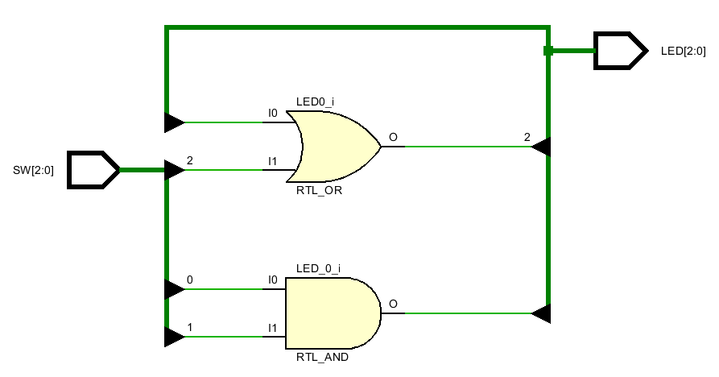

#### 1_1_Parallel_b

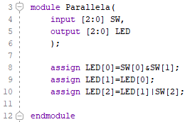

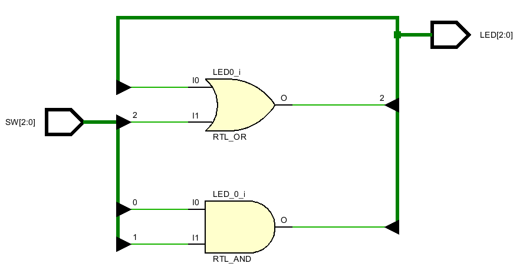

#### 1_1_Parallel_c

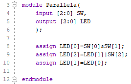

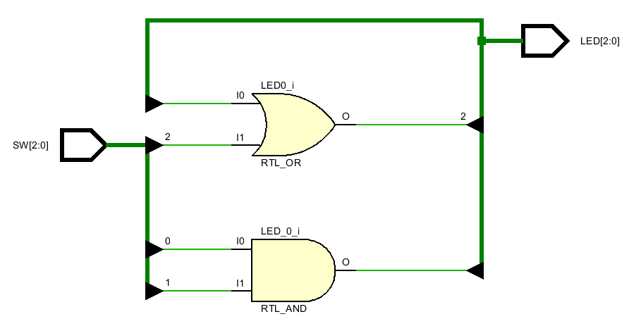

### Line order DOES Matter

#### 1_2_Sequential or Blocking

Should never use always_latch. This was a test to see if the RTL schematic contained a Latch. It doesn't. Even the Register Transfer Analysis (RTL) part of synthesis strips out the Latch. Latches are evil in most circuits. 

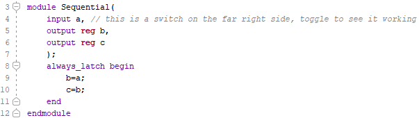

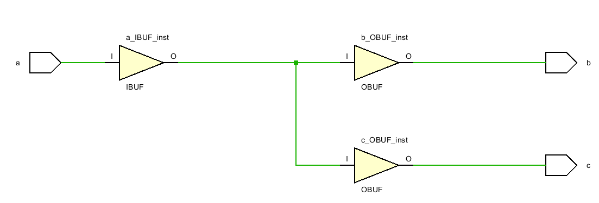

#### 1_3_Non_Blocking_clocked 

Non-Blocking or Non-Sequential has to be clocked.

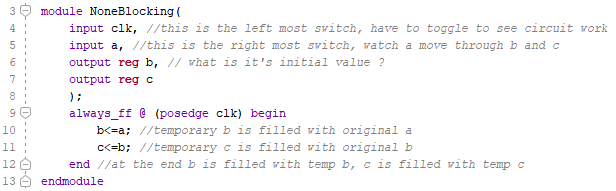

## 2 Loops and Skips

Loops have to terminate when describing circuits. This means the **while** command **is not supported**. The while command  repeats an indeterminate number of times.  [Recursion](https://en.wikipedia.org/wiki/Recursion_(computer_science)) and more generally the [halting problem](https://en.wikipedia.org/wiki/Halting_problem) of software is not possible in hardware. Vendors will not implement this. 

Loops are implemented within **always_comb** create [combinational logic](https://en.wikipedia.org/wiki/Combinational_logic). Loops implemented within **always_ff** create [finite state machines](https://en.wikipedia.org/wiki/Finite-state_machine) and the [synchronous circuits](https://en.wikipedia.org/wiki/Synchronous_circuit)  of modern CPUs, GPUs, and ALUs. Leading edge [Neuromorphic](https://en.wikipedia.org/wiki/Neuromorphic_engineering) and [Asynchronous](https://en.wikipedia.org/wiki/Asynchronous_circuit#Asynchronous_CPU) CPUs are not supported.

#### 2_1_If_Parallel_combinational

The if command is the most heavily used. This circuit has two circuits sharing the same inputs and interpreting them in the same way.   This first circuit is demonstrating if's using the same selection criteria.

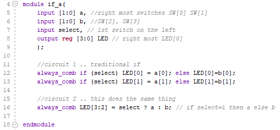

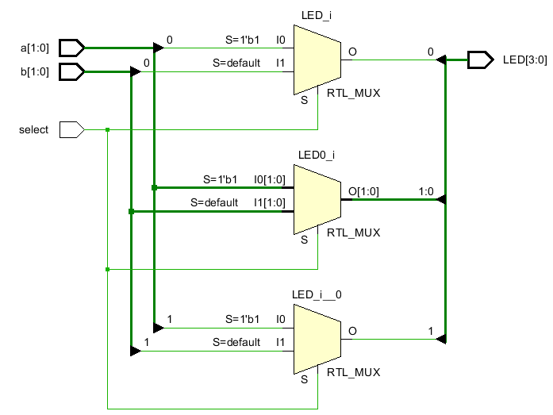

#### 2_1_if_Sequential_combinational

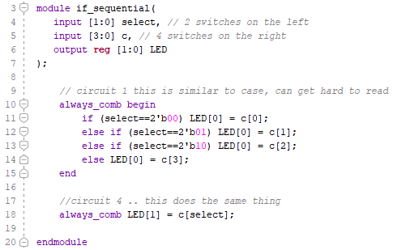

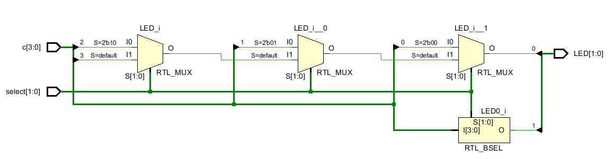

#### 2_1_if_parallel_clocked

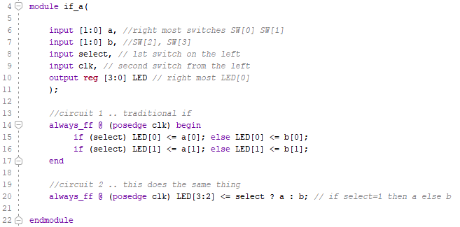

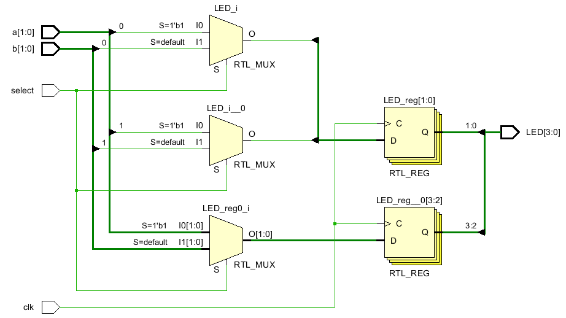

#### 2_1_if_Sequential_clocked

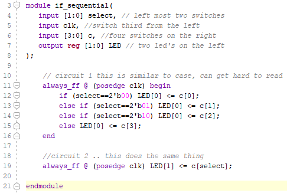

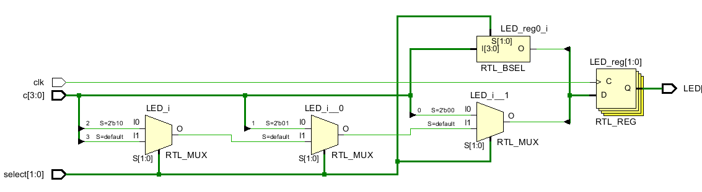

#### 2_2_Case_combinational

It is really hard to find the difference between the case commands and if sequential commands. 

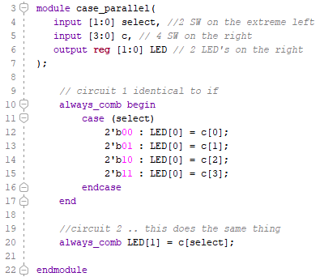

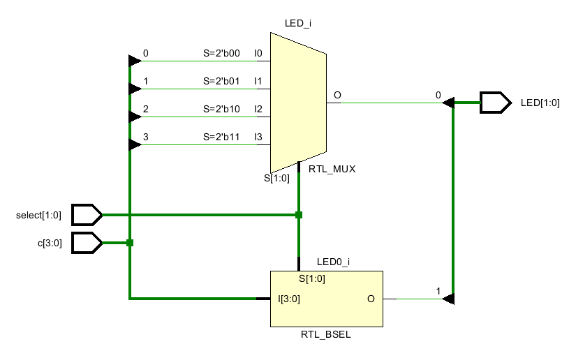

#### 2_2_Case_sequential_clocked

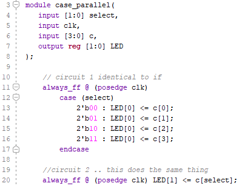

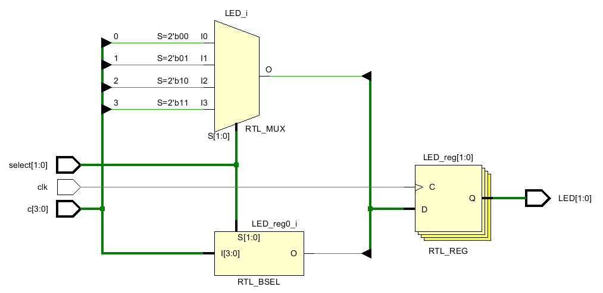

#### 2_3_For_Combinational

This turns a 4 digit hex number (0-15) into a 6 digit decimal number (tens, ones). But it doesn't scale. 

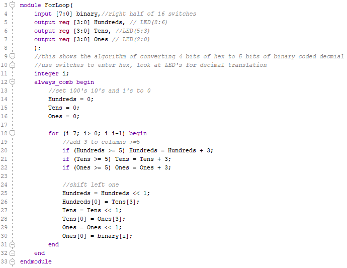

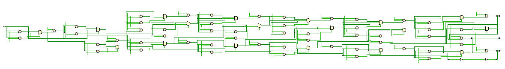

#### 2_3_Not_For_Clocked

Programmers may expect that nested For loops will work inside always_ff or a clocked circuit. They can work. And they can not depending upon what you try to do in the loop. Think of global and local variables. Now think of the opposite. Imagine Local variables that can not be mentioned anywhere else in the code. 

How does the synthesizer create error messages around this situation? How does a designer work around these constraints of the Verilog language? Concepts called port interface drawings, datapaths (combinational circuits), control paths (clocked circuits), finite state machines, algorithmic state machines, ... have evolved. 

Without these concepts, just playing around with manual testing using a clock may work but the minute a 100Mhz clock is hooked up, it doesn't work. There is a brick wall of breaking Nexys 4 DDR switches, of  the synthesizer creating a circuit with missing parts, weird connections and of almost random error messages. One can not learn this through hacking (creating small tests to see what works).

On the other had, the combinatory version above may work, but will become huge, ugly and unsustainable .. How would you grow it to 64 bits? 

This version uses case and if commands and another concept that allows programs to grow arbitrarily large called Parameters. There is one big control_path and one tiny data_path at the end. 

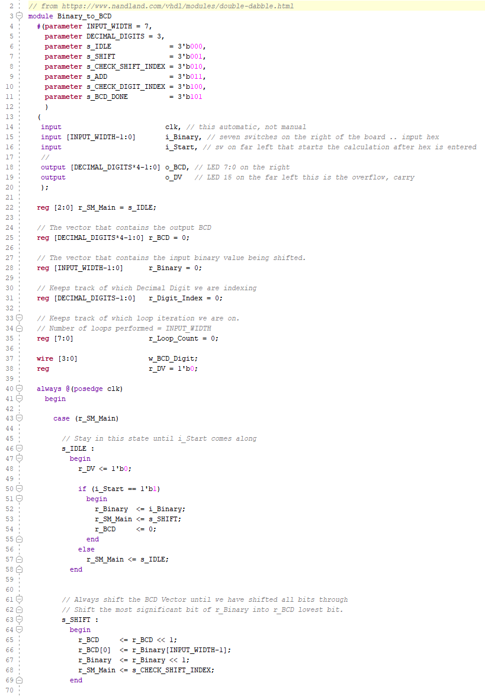

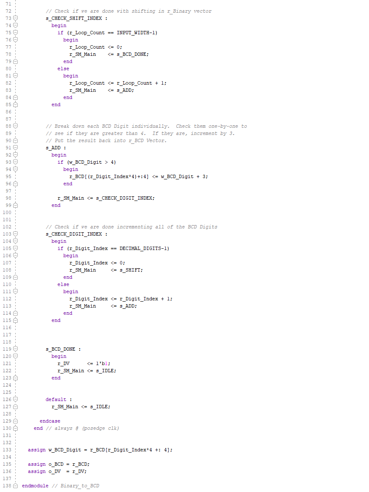

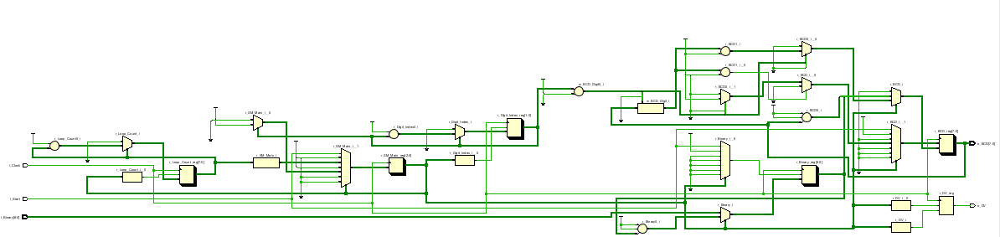

### 3 _7segmentDisplayDemo

The goal here is to present the code .. and a demonstration. The next step after this one is to merge the above code and with the code below. This will require half a semester's worth of concepts that end with complete separation of combinational circuits (called datapath) and clocked circuits (called controlpath). This circuit is pretty good. Certain variables are changed inside the two always_ff control path constructs (c_input, count_clk, anode_clk, segment) and then only looked at by everything else (called the data path).

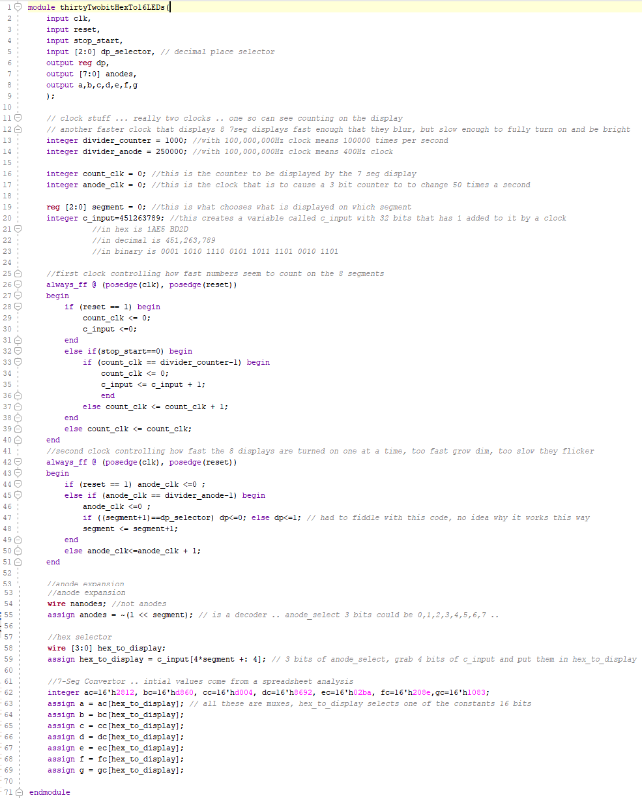

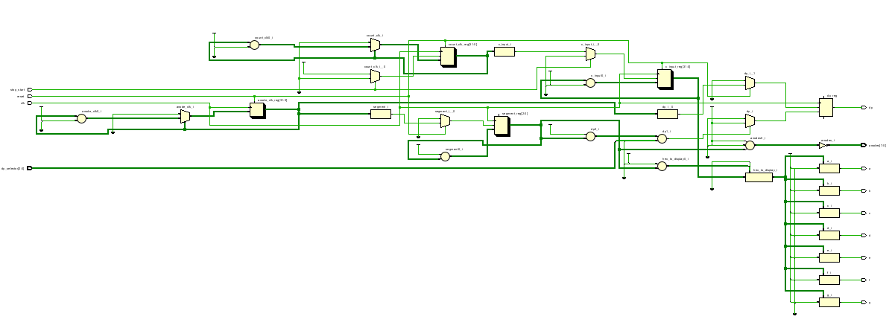

#### 4 Please turn the board off before disconnecting the USB cable.

This is where surges and spikes occur that disable or kill the USB port on the computer or the Nexys 4 DDR board. 

